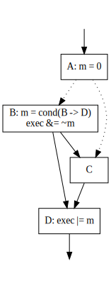

# EuroLLVM19
Implementing SPMD control flow in LLVM using reconverging CFGs - Vectorizing Divergent Control-Flow for SIMD Applications

Authors:
* Fabian Wahlster (TUM)
* Nicolai Hähnle (AMD)

## Abstract
Compiling programs for an SPMD execution model, e.g. for GPUs or for whole program vectorization on CPUs, requires a transform from the thread-level input program into a vectorized wave-level program in which the values of the original threads are stored in corresponding lanes of vectors. The main challenge of this transform is handling divergent control flow, where threads take different paths through the original CFG. A common approach, which is currently taken by the AMDGPU backend in LLVM, is to first structurize the program as a simplification for subsequent steps.

However, structurization is overly conservative. It can be avoided when control flow is uniform, i.e. not divergent. Even where control flow is divergent, structurization is often unnecessary. Moreover, LLVM's StructurizeCFG pass relies on region analysis, which limits the extent to which it can be evolved.

We propose a new approach to SPMD vectorization based on saying that a CFG is reconverging if for every divergent branch, one of the successors is a post-dominator. This property is weaker than structuredness, and we show that it can be achieved while preserving uniform branches and inserting fewer new basic blocks than structurization requires. It is also sufficient for code generation, because it guarantees that threads which "leave" a wave at divergent branches will be able to rejoin it later.

## Resources:

[dot2ll](https://github.com/rAzoR8/dot2ll): Takes a .dot graph as input, transfomrs it to be reconverging, writes output graph to .dot and emits dummy .ll file with AMDGPU PS IR

[LLVM](https://bitbucket.org/razor8/llvmtestbed/src/ReConv): Partial Lowering and CFG Transfrom implementation

[Thesis](https://github.com/rAzoR8/EuroLLVM19/raw/master/docs/Vectorizing%20Divergent%20Control-Flow%20for%20SIMD%20Applications%20-%20Fabian%20Wahlster.pdf): Vectorizing Divergent Control-Flow for SIMD Applications

[Poster](https://github.com/rAzoR8/EuroLLVM19/blob/master/docs/poster.pdf): EuroLLVM 2019 Poster

[Slides](https://github.com/rAzoR8/EuroLLVM19/blob/master/docs/slides_short.pdf): EuroLLVM 2019 Slides

[Presentation](https://github.com/rAzoR8/EuroLLVM19/blob/master/docs/slides_long.pdf): More detailed slides
